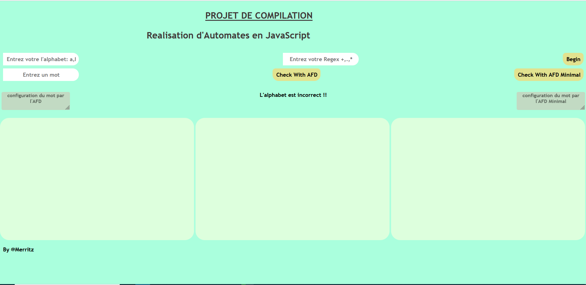
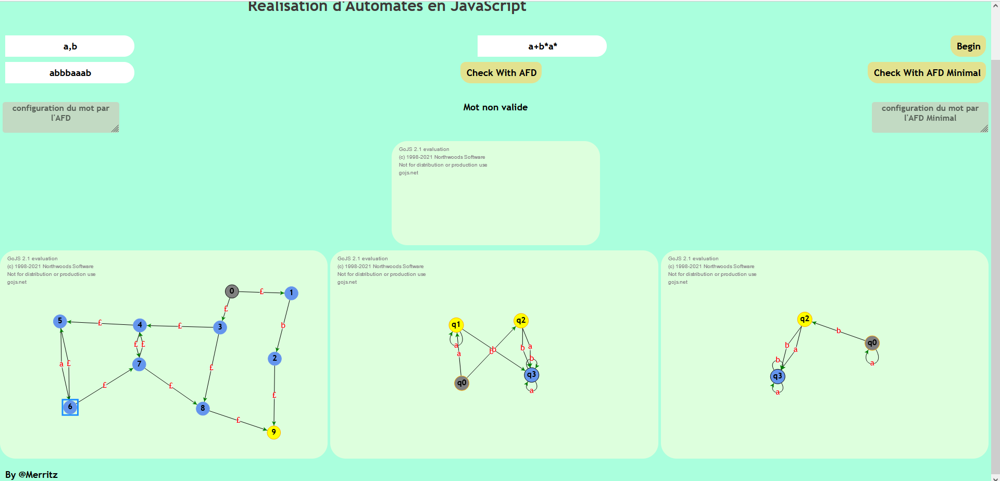
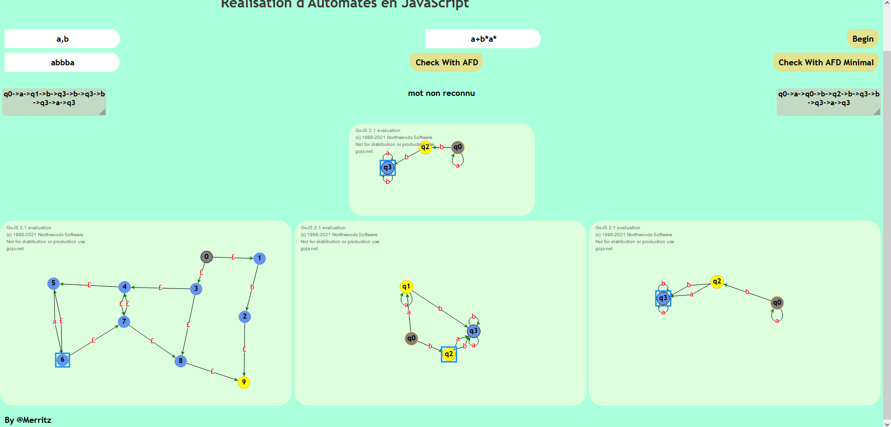

# CONCEPTION D'UN AUTOMATE

  
  
  
  

# TECHNOLOGIES

   <b>CSS</b>

   <b>HTML</b>

   <b>JAVASCRIPT</b>

## Library 
 <b>GOJS</b> 

# DESCRIPTION
Ce projet a pour but de mettre en pratique les acquis du
  cours théorique de COMPILATION , il s'agit de concevoir une
  application qui à partir d'une expréssion régulière sortira
  sur des schémas d'une part, l'automate fini non-déterministe
  (AFN), d'autre part l' automate fini déterministe (AFD),
  d'autre part l'automate fini déterministe minimale (AFDMin).Elle devra egalement etre capable de dire si un mot lut en
  entrer appartient ou pas au langage decrit par une
  expression régulière, on représentera également comment
  cette vérification est éffectuée.

Nous avons implémenter les
  différents algorithmes du cours dans plusieurs modules du
  projet pour réaliser ce projet, il est toutefois a noté que
  nous n'avons pas pris le soin de gerer tout les opérateurs
  réguliers, nous nous sommes attardés sur ceux principalements
  récurrurents lors des séances de cours (*,+,.); Nous ne sommes
  egalement pas responsables d'une expréssion mal écrite ou
  mal evalué donc c'est a vous de vérifier vos expréssions.
Les etats de couleur bleues sont des etats intermédiaires.
Les etats de couleur jaunes et ou former d'un double cercle
  jaune sont des etats d'acceptations.
L'etat de couleur grise est un etat initiale.
Vous avez egalement la posibilité de réorganiser les schemas 
    en déplaçant des etats.

Nous avons placés dans la racine de notre projet un fichier 
  video qui est un petit guide d'utilisation.

# DEMO LINK
https://merritz22.github.io/automate/
